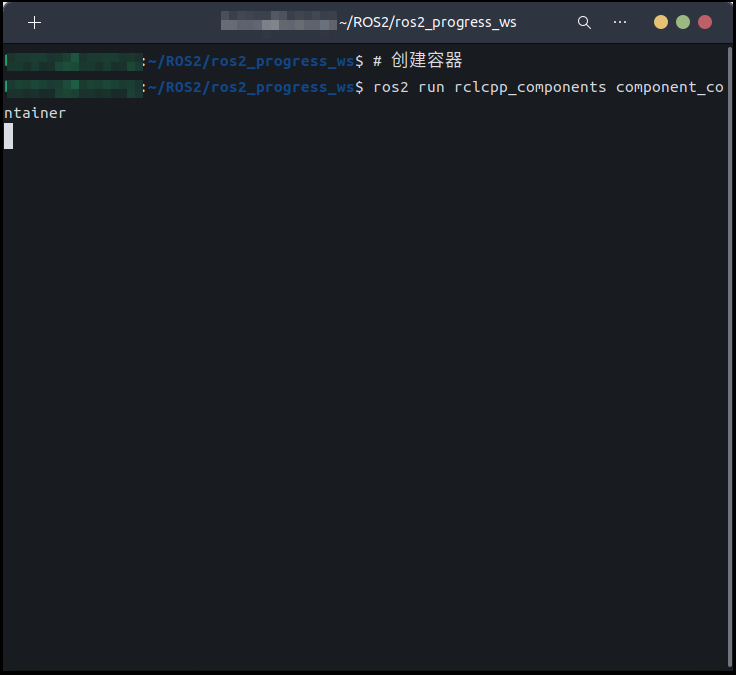
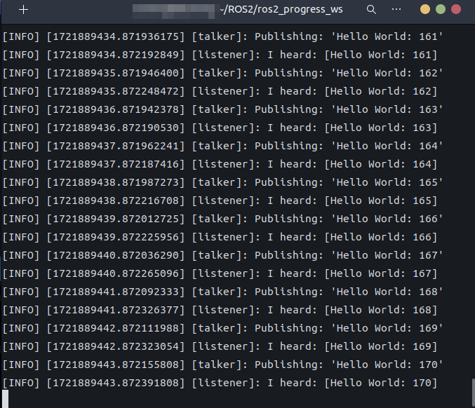
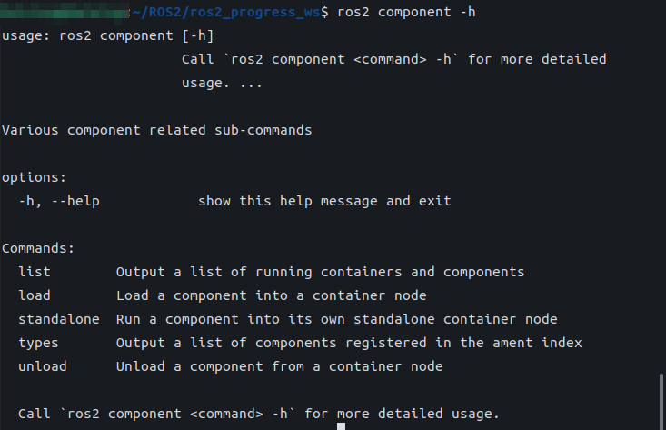
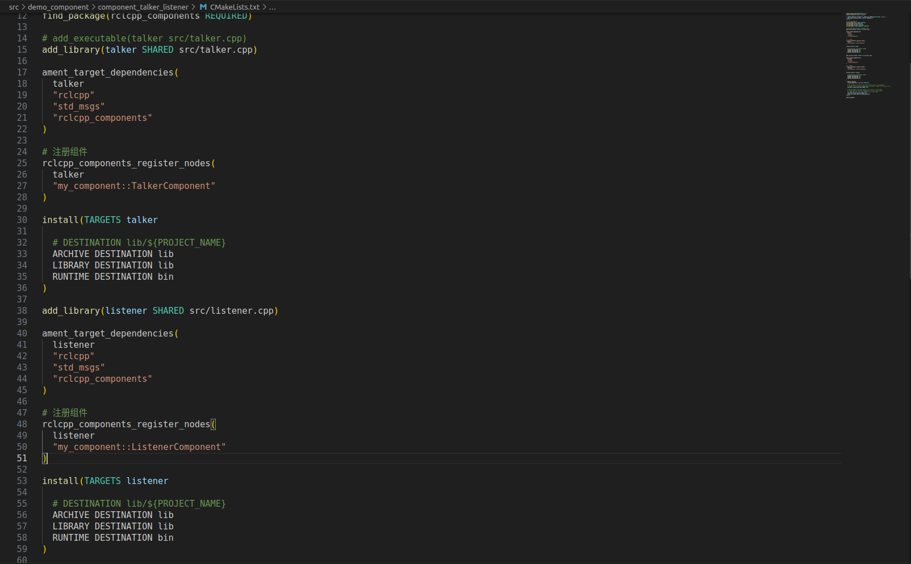

# 组件

## 1.简介

#### 场景

> 在机器人执行复杂任务时，各功能模块需高效协同。例如：
>
> - **视觉感知**：视觉模块实时采集图像，需迅速传递给分析模块，以识别目标或异常。
> - **运动控制**：运动控制模块需基于视觉及传感器数据，实时调整机器人动作，确保安全高效移动。
> - **多传感器融合**：多种传感器（如红外、超声波）持续采集数据，需与其他数据融合，以全面感知环境。
>
> 若各模块以独立节点分散在不同进程，数据传递需经历序列化、反序列化及进程间通信，导致延迟高、资源占用大。在实时性要求高的避障、高速运动控制等场景，此延迟将严重影响机器人性能。因此，如何实现低延迟、低资源占用的数据交互，成为提升机器人系统性能的关键。

在ROS2中，提供了组件优化上述问题。

#### 概念

ROS2中，组件（也称为Composable Nodes）是设计来允许多个功能节点在同一进程中运行的，从而提高资源利用效率和减少通信延迟。这种架构特别适合需要高性能处理的应用。另外，组件也可以作为独立的节点运行，这样也保证了组件的独立性。

#### 作用

组件的作用如下：

1. **性能提升：** 由于减少了进程间通信的需要，组件间的消息传递更快。
2. **灵活性：** 组件可以在系统运行时动态加载和卸载，提供高度的可配置性。
3. **资源优化：** 多个组件共享一个进程的资源，可以减少内存占用和启动时间。

## 2.组件的基本使用流程

ROS2中已经内置了组件的使用示例，可以先执行相关示例以熟悉其使用流程。

### 2.1创建容器

```
ros2 run rclcpp_components component_container
```



### 2.2 往容器中添加组件

```
ros2 component load /ComponentManager composition composition::Talker 
ros2 component load /ComponentManager composition composition::Listener 
```



### 2.3组件操作

组件操作语法可以通过下面指令查看说明文档：

```
ros2 component -h
```



```
ros2 component list #列出当前容器的信息
ros2 component load #把组件添加进容器
ros2 component unload #把容器中的组件卸载
ros2 component standalone #独立运行组件
```


## 3.案例以及案例分析

### 3.1案例需求

**需求：**需要将发布方和订阅方集成到同一进程内，以实现数据收发

### 3.2流程简介

主要步骤如下：

1. 编写源文件；
2. 编辑配置文件；
3. 编译；
4. 执行；
5. 使用launch文件启动组件。

### 3.3准备工作

终端下进入工作空间的src目录，调用如下两条命令分别创建C++功能包。

```
ros2 pkg create component_talker_listener --build-type ament_cmake --dependencies rclcpp std_msgs rclcpp_components --node-name talker
```

## 4.自定义组件的实现

### 4.1编写源文件

在`component_talker_listener`功能包下面的`src`文件夹的`talker.hpp`,添加如下内容

```
/*
    需求：编写发布方的组件，周期性的发布消息
    流程：
        1.导包；
        2.自定义组建类；
          加命名空间
        3.注册组件
*/
#include <rclcpp/rclcpp.hpp>
#include <rclcpp_components/register_node_macro.hpp>
#include "std_msgs/msg/string.hpp"
using namespace std::chrono_literals;
namespace my_component{
// 3.定义节点类；
class TalkerComponent : public rclcpp::Node
{
public:
    TalkerComponent(const rclcpp::NodeOptions & options) : Node("talker_component",options)
    {
      RCLCPP_INFO(this->get_logger(),"Talker组件被创建了");
      publisher_ = this->create_publisher<std_msgs::msg::String>("topic", 10);
      timer_ = this->create_wall_timer(500ms, std::bind(&TalkerComponent::timer_callback, this));
    }
private:
    void timer_callback()
    {
      // 3-3.组织消息并发布。
      auto message = std_msgs::msg::String();
      message.data = "Hello, world! " + std::to_string(count_++);
      RCLCPP_INFO(this->get_logger(), "发布的消息：'%s'", message.data.c_str());
      publisher_->publish(message);
    }
    rclcpp::TimerBase::SharedPtr timer_;
    rclcpp::Publisher<std_msgs::msg::String>::SharedPtr publisher_;
    size_t count_;
};
}

// 3.注册组件
RCLCPP_COMPONENTS_REGISTER_NODE(my_component::TalkerComponent)
```

在`component_talker_listener`功能包下面的`src`文件夹创建`listener.cpp`,并且添加如下内容

```
/*
    需求：编写订阅方的组件，周期性的接受消息
    流程：
        1.导包；
        2.自定义组建类；
          加命名空间
        3.注册组件
*/
#include <rclcpp/rclcpp.hpp>
#include <rclcpp_components/register_node_macro.hpp>
#include "std_msgs/msg/string.hpp"
using namespace std::chrono_literals;
using std::placeholders::_1;
namespace my_component
{
    // 3.定义节点类；
    class ListenerComponent : public rclcpp::Node
    {
    public:
        ListenerComponent(const rclcpp::NodeOptions &options) : Node("ListenerComponent", options)
        {
            RCLCPP_INFO(this->get_logger(), "订阅方组件已启动");
            // 3-1.创建订阅方；
            subscription_ = this->create_subscription<std_msgs::msg::String>("topic", 10, std::bind(&ListenerComponent::topic_callback, this, _1));
        }

    private:
        // 3-2.处理订阅到的消息；
        void topic_callback(const std_msgs::msg::String &msg) const
        {
            RCLCPP_INFO(this->get_logger(), "订阅的消息： '%s'", msg.data.c_str());
        }
        rclcpp::Subscription<std_msgs::msg::String>::SharedPtr subscription_;
    };
}

// 3.注册组件
RCLCPP_COMPONENTS_REGISTER_NODE(my_component::ListenerComponent)
```

### 4.2编辑配置文件

修改配置文件`CMakeLists.txt`

```
add_library(talker SHARED src/talker.cpp)
ament_target_dependencies(
  talker
  "rclcpp"
  "std_msgs"
  "rclcpp_components"
)

#注册组件
rclcpp_components_register_nodes( 
  talker
  "my_component::TalkerComponent"
)

install(TARGETS talker
  # DESTINATION lib/${PROJECT_NAME}
  ARCHIVE DESTINATION lib
  LIBRARY DESTINATION lib
  RUNTIME DESTINATION bin
  )
  
add_library(listener SHARED src/listener.cpp)

ament_target_dependencies(
  listener
  "rclcpp"
  "std_msgs"
  "rclcpp_components"
)

# 注册组件
rclcpp_components_register_nodes(
  listener
  "my_component::ListenerComponent"
)

install(TARGETS listener

  # DESTINATION lib/${PROJECT_NAME}
  ARCHIVE DESTINATION lib
  LIBRARY DESTINATION lib
  RUNTIME DESTINATION bin
)
```



### 4.3编译

终端中进入当前工作空间，编译功能包：

```
colcon build --packages-select component_talker_listener
```

### 4.4执行

当前工作空间下，启动两个终端

终端1输入如下指令：

```
. install/setup.bash
ros2 run rclcpp_components component_container
```

终端2输入如下指令：

```
ros2 component load /ComponentManager component_talker_listenermy_component::TalkerComponentt
ros2 component load /ComponentManager component_talker_listenermy_component::ListenerComponentt
```

### 4.5launch启动组件

在`component_talker_listener`功能包下创建launch文件夹，并且创建`my_commponent.launch.py`的文件,并添加下面程序

```python
from launch import LaunchDescription
from launch_ros.actions import ComposableNodeContainer
from launch_ros.descriptions import ComposableNode

def generate_launch_description():
    container = ComposableNodeContainer(
        package="rclcpp_components",
        executable="component_container",
        name="container",
        namespace="my_component",
        composable_node_descriptions=[
            ComposableNode(
                package="component_talker_listener",
                plugin="my_component::TalkerComponent",
            ),
            ComposableNode(
                package="component_talker_listener",
                plugin="my_component::ListenerComponent",
            )
        ]
    )
    return LaunchDescription([container])

```

在配置文件`CMakeLists.txt`添加下面这一行

```
install(DIRECTORY launch DESTINATION share/${PROJECT_NAME})
```

终端1输入如下指令：

```
. install/setup.bash
ros2 launch component_talker_listener my_commponent.launch.py
```

最终运行结果与终端执行类似。


## 5. 小结

#### 核心价值

1. 高效通信

   组件通过进程内运行，消除进程间通信开销（如序列化/反序列化），显著降低延迟，提升实时性，适用于避障、高速运动控制等场景。

2. 资源优化

   共享进程资源，减少内存占用和启动时间，支持动态加载/卸载组件，适应灵活配置需求。

------

#### 关键实践流程

1. 基础操作
   - **启动容器**：`ros2 run rclcpp_components component_container`
   - **加载组件**：`ros2 component load` 动态添加组件
   - **组件管理**：支持 `list`（查看）、`unload`（卸载）等操作
2. 开发流程
   - **源文件编写**：继承 `rclcpp::Node` 实现组件功能，注册组件。
   - **配置与编译**：修改 `CMakeLists.txt`，生成共享库。
   - **启动方式**：手动加载组件或通过 `launch` 文件一键启动。

------

#### 优势总结

1. **性能提升**：进程内通信降低延迟，提升系统响应速度。
2. **资源高效**：减少内存和启动开销，支持动态扩展。


